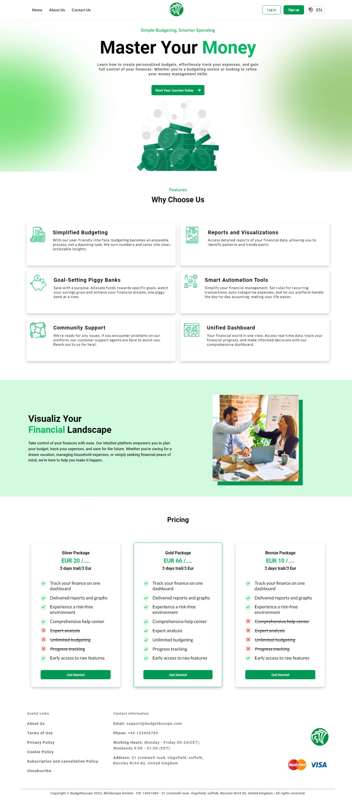

# Responsive Money Management Website



## Overview

This repository contains the source code for a responsive money management website. The website is built using raw HTML5, CSS3 and JavaScript, providing a simple yet effective solution for tracking and managing finances across different devices.

## Features

- Responsive design for optimal viewing on various screen sizes (desktop, tablet, and mobile).
- Using html5 and CSS3 syntax.
- Maintaining good practices.
- Straightforward and intuitive user interface for easy navigation.
- Utilizes raw HTML5 and CSS3 for a lightweight and fast-loading website.

## Screenshots


## Usage

1. Clone the repository:

   ```bash
   https://github.com/fajlay-rabbi/Responsive-money-management-website-using-raw-html5-and-css3.git


# UI Inspiration From:

    https://www.behance.net/gallery/189723151/Budgeting-Landing-Page-UIUX-Design/modules/1072900085


# Don't forget to give a star ⭐ if you like it.
    